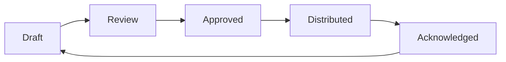

## Overview

The Policies section helps you create, version, approve, and distribute security policies. Maintain a comprehensive policy library that meets compliance requirements.

## Policy Lifecycle

| Stage | Description |
|-------|-------------|
| **Draft** | Initial creation or revision |
| **Review** | Stakeholder review and feedback |
| **Approved** | Formally approved by authority |
| **Distributed** | Sent to relevant employees |
| **Acknowledged** | Employees confirm receipt and understanding |

## Creating Policies

### From Template

1. Navigate to **Compliance** → **Policies**
2. Click **Create Policy**
3. Select **From Template**
4. Choose a template category:
   - Information Security Policy
   - Acceptable Use Policy
   - Access Control Policy
   - Incident Response Plan
   - Business Continuity Plan
   - Data Classification Policy
   - And more...
5. Customize content for your organization
6. Save as draft

### From Scratch

1. Click **Create Policy**
2. Select **Blank Policy**
3. Enter policy details:
   - **Title** - Clear, descriptive name
   - **Category** - Policy type
   - **Owner** - Responsible party
   - **Review Cycle** - Annual, semi-annual, etc.
4. Write policy content
5. Save as draft

## Policy Editor

The policy editor supports:

- **Rich Text** - Formatting, lists, tables
- **Sections** - Organized structure
- **Variables** - Dynamic placeholders (company name, etc.)
- **Version Notes** - Document changes between versions

## Approval Workflow

### Configuring Approvers

Each policy can have multiple approvers:

1. Open the policy
2. Click **Settings** → **Approvers**
3. Add required approvers (e.g., CISO, Legal, HR)
4. Set approval order (sequential or parallel)

### Submitting for Approval

1. Complete policy draft
2. Click **Submit for Review**
3. Approvers receive notification
4. Track approval status in dashboard

### Approval Actions

Approvers can:
- **Approve** - Move policy forward
- **Reject** - Return with feedback
- **Comment** - Add notes without decision

## Version Control

### Versioning

Policies are automatically versioned:

- **Major versions** (1.0, 2.0) - Significant changes
- **Minor versions** (1.1, 1.2) - Small updates

### Version History

View all versions:
- Previous content
- Change notes
- Approval history
- Distribution records

### Comparing Versions

1. Open policy
2. Click **Version History**
3. Select two versions
4. Click **Compare**
5. View highlighted differences

## Distributing Policies

### Distribution Methods

| Method | Use Case |
|--------|----------|
| **Email** | Send policy with acknowledgment link |
| **In-App** | Notify users within Bastion |
| **Download** | Provide PDF for external use |

### Creating a Distribution

1. Ensure policy is approved
2. Click **Distribute**
3. Select audience:
   - All employees
   - Specific groups
   - Individual users
4. Set acknowledgment deadline
5. Customize message
6. Send

### Tracking Acknowledgments

Monitor acknowledgment progress:

- **Pending** - Not yet acknowledged
- **Acknowledged** - Confirmed receipt
- **Overdue** - Past deadline

Send reminders to employees who haven't acknowledged.

## Policy Library

### Organizing Policies

Organize policies by:

- **Category** - Security, HR, IT, etc.
- **Status** - Draft, Approved, Archived
- **Owner** - Responsible department
- **Framework** - Related compliance requirements

### Search and Filter

Find policies using:
- Full-text search
- Category filters
- Status filters
- Date ranges

## Document Repository

Beyond policies, manage:

- **Procedures** - Step-by-step instructions
- **Standards** - Technical requirements
- **Guidelines** - Best practices
- **Diagrams** - Architecture and process flows

## Compliance Mapping

### Linking to Controls

Map policies to compliance controls:

1. Open policy
2. Click **Compliance Mapping**
3. Select relevant framework controls
4. Save mapping

This creates evidence links for audit purposes.

## Best Practices

<AccordionGroup>
  <Accordion title="Keep Policies Concise" icon="compress">
    Long, complex policies are less likely to be read and followed. Focus on essential requirements.
  </Accordion>
  <Accordion title="Review Regularly" icon="calendar-check">
    Set review cycles (typically annual) and stick to them. Outdated policies create compliance gaps.
  </Accordion>
  <Accordion title="Use Clear Language" icon="spell-check">
    Avoid jargon and legalese. Policies should be understandable by all employees.
  </Accordion>
  <Accordion title="Track Acknowledgments" icon="check-double">
    Ensure all relevant employees acknowledge policies. Follow up on non-responses.
  </Accordion>
</AccordionGroup>

## Next Steps

<CardGroup cols={2}>
  <Card title="Vendors" icon="building" href="/compliance/vendors">
    Manage vendor compliance
  </Card>
  <Card title="Risk Register" icon="exclamation-triangle" href="/compliance/risk-register">
    Document organizational risks
  </Card>
</CardGroup>
