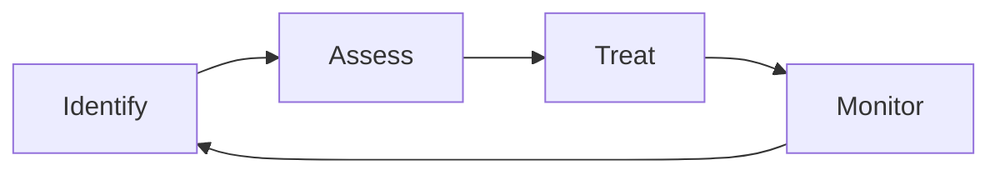

## Overview

The Risk Register helps you identify, assess, and track security risks across your organization. Risk management is a core compliance requirement and a fundamental security practice.

## Risk Management Process



| Phase | Description |
|-------|-------------|
| **Identify** | Discover potential risks |
| **Assess** | Evaluate likelihood and impact |
| **Treat** | Decide how to handle the risk |
| **Monitor** | Track risk status over time |

## Identifying Risks

### Risk Sources

Common risk sources include:

- **Vulnerabilities** - Technical weaknesses
- **Threats** - External and internal actors
- **Compliance** - Regulatory requirements
- **Vendors** - Third-party dependencies
- **Processes** - Operational weaknesses
- **Assets** - Critical asset exposure

### Adding Risks

1. Navigate to **Compliance** → **Risk Register**
2. Click **Add Risk**
3. Enter risk details:
   - **Title** - Clear, descriptive name
   - **Description** - Detailed explanation
   - **Category** - Risk type
   - **Owner** - Responsible party
   - **Source** - How the risk was identified
4. Click **Save**

### Risk Categories

| Category | Examples |
|----------|----------|
| **Technical** | System vulnerabilities, misconfigurations |
| **Operational** | Process failures, human error |
| **Compliance** | Regulatory violations, audit failures |
| **Strategic** | Business decisions, market changes |
| **Reputational** | Brand damage, customer trust |
| **Financial** | Fraud, financial loss |

## Assessing Risks

### Risk Scoring

Evaluate each risk on two dimensions:

**Likelihood** - How likely is the risk to occur?

| Score | Level | Description |
|-------|-------|-------------|
| 1 | Rare | Unlikely to occur |
| 2 | Unlikely | Could occur but not expected |
| 3 | Possible | May occur |
| 4 | Likely | Expected to occur |
| 5 | Almost Certain | Will occur |

**Impact** - What is the potential damage?

| Score | Level | Description |
|-------|-------|-------------|
| 1 | Negligible | Minimal impact |
| 2 | Minor | Limited impact |
| 3 | Moderate | Noticeable impact |
| 4 | Major | Significant damage |
| 5 | Severe | Critical damage |

### Risk Rating

Risk Rating = Likelihood × Impact

| Rating | Level | Action Required |
|--------|-------|-----------------|
| 1-4 | Low | Accept or monitor |
| 5-9 | Medium | Mitigate when possible |
| 10-16 | High | Mitigate promptly |
| 17-25 | Critical | Immediate action required |

### Risk Matrix

Visual representation of risk distribution:

```
Impact
  5 │  5  10  15  20  25
  4 │  4   8  12  16  20
  3 │  3   6   9  12  15
  2 │  2   4   6   8  10
  1 │  1   2   3   4   5
    └─────────────────────
        1   2   3   4   5
            Likelihood
```

## Treating Risks

### Treatment Options

| Option | Description | When to Use |
|--------|-------------|-------------|
| **Mitigate** | Reduce likelihood or impact | Risk is too high to accept |
| **Accept** | Acknowledge and monitor | Risk is within tolerance |
| **Transfer** | Shift risk to another party | Insurance, contracts |
| **Avoid** | Eliminate the risk source | Risk outweighs benefit |

### Creating Treatment Plans

For risks requiring mitigation:

1. Open the risk
2. Click **Add Treatment Plan**
3. Define treatment actions:
   - **Action** - Specific mitigation step
   - **Owner** - Responsible person
   - **Due Date** - Target completion
   - **Status** - Progress tracking
4. Track implementation

### Treatment Status

| Status | Meaning |
|--------|---------|
| **Planned** | Treatment defined but not started |
| **In Progress** | Implementation underway |
| **Completed** | Treatment implemented |
| **Verified** | Effectiveness confirmed |

## Risk Tasks

### Automated Risk Identification

Bastion can automatically identify risks from:

- **Vulnerability Scans** - Technical vulnerabilities
- **Integration Data** - Configuration issues
- **Compliance Gaps** - Missing controls
- **Vendor Issues** - Third-party risks

### Risk Tasks Queue

Review identified risks in the tasks queue:

1. Navigate to **Risk Register** → **Tasks**
2. Review each identified risk
3. Accept to add to register, or dismiss

## Monitoring and Reporting

### Risk Dashboard

The risk dashboard shows:

- **Risk Distribution** - By category and rating
- **Treatment Progress** - Open vs. resolved
- **Trend Analysis** - Risk changes over time
- **Owner Summary** - Risks by owner

### Key Risk Indicators (KRIs)

Track metrics that indicate risk levels:

- Security incidents per month
- Vulnerability remediation time
- Compliance control failures
- Employee security training completion

### Reports

Generate risk reports:

- **Risk Register Export** - Complete risk listing
- **Executive Summary** - High-level overview
- **Treatment Status** - Mitigation progress
- **Trend Report** - Historical analysis

## Compliance Integration

### Framework Mapping

Map risks to compliance controls:

- Demonstrates risk-aware approach to auditors
- Links risks to specific control objectives
- Creates evidence for risk management controls

### Audit Evidence

Risk management activities provide evidence for:

- Risk assessment requirements
- Management review controls
- Continuous monitoring controls

## Best Practices

<AccordionGroup>
  <Accordion title="Be Comprehensive" icon="search">
    Don't limit risk identification to obvious threats. Consider all risk sources including process, people, and vendor risks.
  </Accordion>
  <Accordion title="Assign Ownership" icon="user">
    Every risk needs an owner. Without ownership, risks go unaddressed.
  </Accordion>
  <Accordion title="Review Regularly" icon="calendar">
    Risk ratings change over time. Review the register quarterly to update assessments.
  </Accordion>
  <Accordion title="Document Decisions" icon="pen">
    Document why risks are accepted or how treatments were chosen. This context is valuable for audits.
  </Accordion>
</AccordionGroup>

## Next Steps

<CardGroup cols={2}>
  <Card title="Access Reviews" icon="user-check" href="/compliance/access-reviews">
    Conduct access reviews to mitigate access risks
  </Card>
  <Card title="Frameworks" icon="list-check" href="/compliance/frameworks">
    Map risks to compliance controls
  </Card>
</CardGroup>
